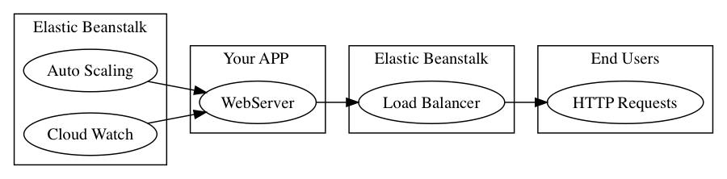
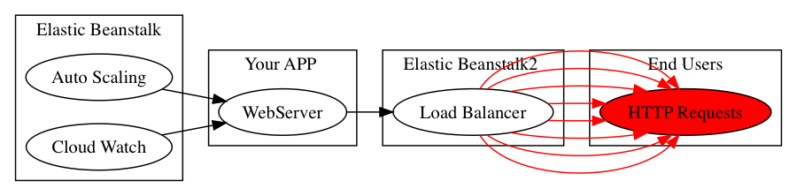
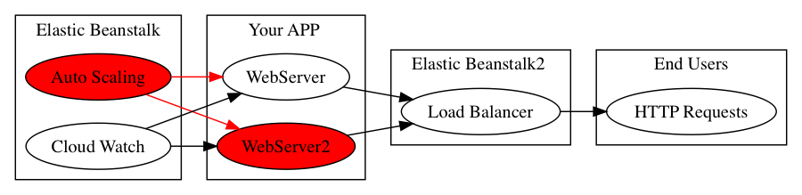

!SLIDE center subsection

# Elastic Beanstalk Overview

This Section Provides an Overview of Elastic Beanstalk

!SLIDE

# Contents

* Overview of Our Web App
* Additional Uses of EB

!SLIDE 

# Our Web App from the Demo

!SLIDE

# Our Web App with Increased Load

!SLIDE

# Auto Scaling Invoked

!SLIDE

# Additional Uses of EB

* More than just for Web Apps
  * Used as simple Example

!SLIDE

# Elastic Beanstalk Supported Platforms

* Docker
* Go
* Java
* .NET
* Node.js
* PHP
* Python
* Ruby

!SLIDE

# Managing Auto Scaling

* Configure Triggers
* Scale based on a schedule
* Replace Failed Instances

!SLIDE

# Managing Load Balancer

* Classic LB
  * Sticky Sessions
* Application LB
  * Path Based
* Network LB
  * OSI Level 4
  * More efficient than Classic
  
!SLIDE

# Monitoring

* Health Reporting
* Basic Health Check
  * TCP request every 10 seconds
* Advanced Health Monitoring  
  
!SLIDE

# Review

Elastic Beanstalk deploys you app to the AWS cloud and surrounds the app with useful tools to enable: 

* AutoScaling
* Health Monitoring
* Load Balancing

!SLIDE

# Deployment

Elastic Beanstalk simplifies Application deployment by allowing Command line Web Based synching of local files with remote APP server, allowing for

* Easy updating
* Management of Dev and Production Environments

!SLIDE

# Review

## What Elastic Beanstalk Does

Elastic Beanstalk automatically handles the details of

* capacity provisioning,
* load balancing,
* scaling,
* application health monitoring

of an application.

!SLIDE 

# Thanks for Attending this Course. 
